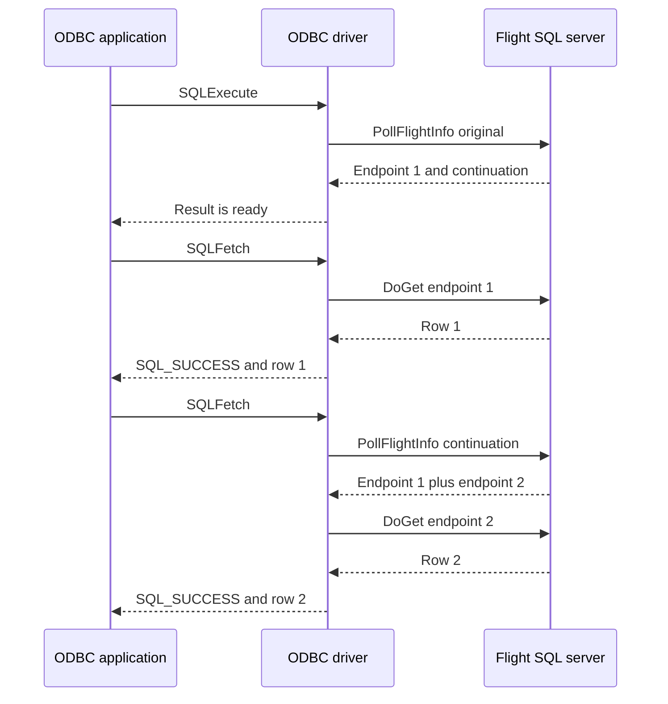

# BDX-645 Arrow C++ Flight SQL / ODBC PollInfo POC

## Verdict

**Feasible with documented limitations**

Transparent progressive polling is feasible for existing Arrow ODBC execution
and metadata paths without changing their result-set API. Shared-server tests
prove that `SQLFetch` can download a published endpoint before query completion,
then request the next continuation only when the current stream is exhausted.
They also cover late failure at the next fetch boundary, family-scoped fallback,
one-deadline timeout, active-fetch cancellation, and incomplete-result close.
The material limitation is pre-existing: Arrow ODBC does not export or implement
`SQLBindParameter`, so a public parameterized prepared statement cannot be used
to prove the contract's one-bind T3 requirement even though the underlying C++
`PreparedStatement::Execute` binds its optional RecordBatch exactly once before
the now-virtual `GetFlightInfo` dispatch.

## Repository and baseline

- Repository: `/Users/helder/Documents/Codex/2026-09-10/bdx-645-pollinfo-orchestrator/workstreams/arrow`
- Upstream revision: `79e074ace3a7c4ca26f211dfd84a1984ad53c362`
- Local branch: `bdx-645-pollinfo-poc`
- Initial status: clean
- Review branch: `xborder/arrow` PR #3
- Baseline `SQLCancel`: executable call returned `SQL_ERROR`, SQLSTATE `IM001`,
  message `SQLCancel is not implemented`; the upstream entry point unconditionally
  threw exactly that diagnostic.

## POC design and behavior

`ProgressivePollInfoOperation` is an internal C++ Flight SQL helper with a narrow
RPC seam. It sends the original descriptor once, retains the continuation and
cumulative endpoint prefix, and returns the first published endpoint without
waiting for final completion. `FlightStreamChunkBuffer` requests the next
continuation only after its current queue is exhausted and appends only the new
suffix. `PollFlightInfoUntilComplete` reuses the same operation for final-only
shared-library callers. Only initial `UNIMPLEMENTED` can fall back.

`PollingFlightSqlClient` overrides the existing virtual `GetFlightInfo`, so all
C++ Flight SQL commands that used that method are covered centrally.  One such
client belongs to one physical `FlightSqlConnection`; its unsupported cache is
mutex-protected and keyed by exact protobuf Any type URL.  Public
`SQLExecDirectW` retains the upstream `Prepare` + `ExecutePrepared` behavior, so
its family is `CommandPreparedStatementQuery`.  Metadata command types have
independent keys.  Shared T5 proves isolation.

The helper constructs one steady-clock deadline from `SQL_ATTR_QUERY_TIMEOUT`
and passes only the decreasing remainder to each poll.  Deadline expiration
between polls and a transport `FlightStatusCode::TimedOut` after partial state
both trigger exactly one best-effort cancel using a fresh one-second,
`StopToken::Unstoppable` context.  That cleanup context does not reset or weaken
the query deadline.

Every result-producing statement entry initializes an operation StopSource.
`SQLCancel` deliberately does not take the ODBC execute-handle mutex; it requests
that StopSource first and cancels an existing result set second.  The gRPC
PollFlightInfo transport bridges StopToken to `ClientContext::TryCancel` with a
scoped watcher.  Shared T9 proves this interrupts the synchronous poll before a
result set exists, then records one `CancelFlightInfo`.  Prepared-handle cleanup
uses an unstoppable copy of the options so the stopped operation token cannot
cause a second exception during destruction.

The public fetch surface is unchanged. `FlightSqlResultSet` and
`FlightStreamChunkBuffer` carry the internal progressive operation so existing
`SQLFetch` calls remain the read boundary.

## Public API and configuration surface

- No new query, result-set, extension, or async API.
- Standard existing `SQLCancel(SQLHSTMT)` changes from baseline `IM001` to a
  functional synchronous cancellation path.
- New connection property `UsePollInfo`; default is `true`, `false` restores the
  exact legacy `GetFlightInfo` command path.  It is consumed as a built-in and is
  not forwarded as Flight RPC metadata.
- `SQLCancelHandle` is not declared by the macOS iODBC headers used here and was
  not added; T9 uses the contract-permitted `SQLCancel` path.

## Request flow

The execution deadline decreases across polls. A late continuation failure becomes diagnostics on the next `SQLFetch`. `SQLCancel` interrupts a blocked fetch, and `SQLCloseCursor` on an incomplete result attempts best-effort cancellation. T3 remains outside the flow because public parameter binding is absent upstream.

## T1-T10 result matrix

| Test | Status | Executable result and shared-server counters |
| --- | --- | --- |
| T1 immediate | PASS | Rows `[1,2]`; prepared `poll=1,get=0,original=1,continuation=0,do_get=1`. |
| T2 progressive multi-step | PASS | Rows `[1,2,3]`; direct events are `Poll, DoGet, Poll, DoGet, Poll, DoGet`, proving partial downloads before completion. |
| T3 parameterized prepared | BLOCKED | `SQLBindParameter=-1`, diagnostic retrieval `0`, `IM001`, native `0`, `[iODBC][Driver Manager]Driver does not support this function`; server `bind=0,poll=0,get=0`. |
| T4 metadata | PASS | One catalog row; metadata `poll=3,get=0,original=1,continuation=2,do_get=1`. |
| T5 fallback/cache | PASS | Prepared family `poll=1,get=2`; independent metadata family `poll=3,get=0`; first initial UNIMPLEMENTED probes and later prepared call skips poll. |
| T6 opt-out | PASS | `UsePollInfo=false`; legacy prepared family `poll=0,get=1,do_get=1`; rows `[1,2]`. |
| T7 ambiguous failure | PASS | Prepared UNAVAILABLE becomes `SQL_ERROR`; `poll=1,get=0,original=1,do_get=0`. |
| T8 timeout | PASS | 1-second attribute returned in 1021ms; `poll=1,get=0,active_call_terminations=1`; focused multi-continuation tests prove decreasing/no-reset deadline and cancel-on-partial timeout. |
| T9 cancellation and close | PASS | `SQLCancel` interrupts a blocked `SQLFetch`; `SQLCloseCursor` after the first endpoint attempts one `CancelFlightInfo`; delivered rows remain valid. |
| T10 regression | PASS | Build succeeded; focused progressive PollInfo selection 17/17; shared selection 11/11; final ODBC SPI 101/101. |

The three full ODBC failures are
`ConnectionInfoTest/0.TestSQLGetInfoDriverHdbc`, `...DriverHenv`, and
`...DriverHlib`, each returning zero where the test expects a positive handle.
The upstream test source labels all three as implemented by the Driver Manager
alone.  They were the same three failures in the initial 687-test run before the
nine gated conformance tests were added, and the POC does not change those tests
or iODBC.  The 316 skips are existing remote-environment skips plus the nine
shared tests when their opt-in port variable is absent.

## Shared fixture identity

- Flight: `127.0.0.1:31647`; control: `127.0.0.1:31648`
- `/state`: revision `dev`, configuration `{}`
- Fixture repository has no commit; rebuilt binary SHA-256:
  `edde2124579d8c30eeec0f6d7c4a96aa62008591e2ed4cf341b9454adb9b6e4d`
- Source identity hashes are in `reports/raw/server-revision.log`.
- Each shared case used `POST /reset`, then an independently bounded gtest, then
  a `/state` snapshot.  No case hung or exceeded its bound.

## Commands and build environment

Principal commands and exit outcomes are preserved in
`reports/raw/build-and-regression.log` and `reports/raw/shared-t1-t9.log`.
The build used Apple Clang 17.0.0 (arm64), CMake 4.0.2, and Ninja 1.12.1.

The host had x86_64/stale dependencies under `/usr/local` while compiling arm64.
All workarounds were confined to `build-bdx645`: arm64 zlib, hermetic dependency
include/library symlinks, and fetched-dependency warning suppressions.  None is in
the experimental Arrow source patch.

`git diff --check` exited 0 with no output before artifact generation.

## Changed files

- `cpp/src/arrow/flight/sql/poll_info_internal.h`
- `cpp/src/arrow/flight/sql/poll_info_internal.cc`
- `cpp/src/arrow/flight/sql/CMakeLists.txt`
- `cpp/src/arrow/flight/sql/odbc/odbc_impl/polling_flight_sql_client.h`
- `cpp/src/arrow/flight/sql/odbc/odbc_impl/polling_flight_sql_client.cc`
- `cpp/src/arrow/flight/sql/odbc/odbc_impl/polling_flight_sql_client_test.cc`
- `cpp/src/arrow/flight/sql/odbc/odbc_impl/flight_sql_connection.h`
- `cpp/src/arrow/flight/sql/odbc/odbc_impl/flight_sql_connection.cc`
- `cpp/src/arrow/flight/sql/odbc/odbc_impl/flight_sql_connection_test.cc`
- `cpp/src/arrow/flight/sql/odbc/odbc_impl/flight_sql_statement.h`
- `cpp/src/arrow/flight/sql/odbc/odbc_impl/flight_sql_statement.cc`
- `cpp/src/arrow/flight/sql/odbc/odbc_impl/flight_sql_statement_polling_test.cc`
- `cpp/src/arrow/flight/sql/odbc/odbc_impl/CMakeLists.txt`
- `cpp/src/arrow/flight/sql/odbc/odbc_api_internal.h`
- `cpp/src/arrow/flight/sql/odbc/odbc_api.cc`
- `cpp/src/arrow/flight/sql/odbc/entry_points.cc`
- `cpp/src/arrow/flight/sql/odbc/tests/poll_info_conformance_test.cc`
- `cpp/src/arrow/flight/sql/odbc/tests/CMakeLists.txt`
- `cpp/src/arrow/flight/transport/grpc/grpc_client.cc`
- `cpp/src/arrow/flight/flight_test.cc`

The report, JSONL, raw logs, inventory, and experimental patch under `reports/`
are additional deliverables, not runtime source.

## Limitations and production blockers

1. Public parameterized ODBC prepared execution remains fundamentally blocked by
   upstream's absent `SQLBindParameter`; T3 is not claimed as a pass.
2. `SQLCancelHandle` was not independently validated/implemented because iODBC's
   headers lack it; `SQLCancel` is fully exercised.
3. The 10ms gRPC StopToken watcher is suitable POC evidence but needs lifecycle,
   performance, and cross-platform review for production.
4. Cancellation races before `BeginExecution`, concurrent statement destruction,
   simultaneous first probes for one unsupported family, and all authentication/
   transport combinations need production stress coverage.
5. The shared fixture reports a content hash rather than a Git revision because
   its repository has no commit.

## Smallest production follow-up

### C++ Flight SQL shared library

1. Promote the polling helper as a private implementation detail with an agreed
   export boundary and reuse it from other synchronous Flight SQL integrations.
2. Integrate StopToken cancellation into the general gRPC unary-call lifecycle,
   replacing or formally approving the PollFlightInfo-specific watcher.
3. Retain the focused matrix for initial-only fallback, cumulative final info,
   shrinking deadline, local/transport timeout cleanup, and stop cancellation.

### ODBC integration and hardening

1. Implement the existing ODBC parameter binding surface (including descriptors)
   before claiming parameterized T3; then run the shared one-bind test unchanged.
2. Make execution lifecycle/cleanup explicitly no-throw and stress SQLCancel
   versus execute, close, and handle destruction on iODBC, unixODBC, and Windows.
3. Add `SQLCancelHandle` only where the target ODBC headers/manager expose the
   standard API, routing statement handles to the same StopSource.
4. Document `UsePollInfo` and validate DSN parsing plus physical-connection cache
   lifetime in pooled/reconnected configurations.

## Deliverables

- `reports/call-site-inventory.md`
- `reports/evidence.jsonl`
- `reports/raw/initial-and-baseline.log`
- `reports/raw/shared-t1-t9.log`
- `reports/raw/build-and-regression.log`
- `reports/raw/server-revision.log`
- `reports/experimental.patch`
